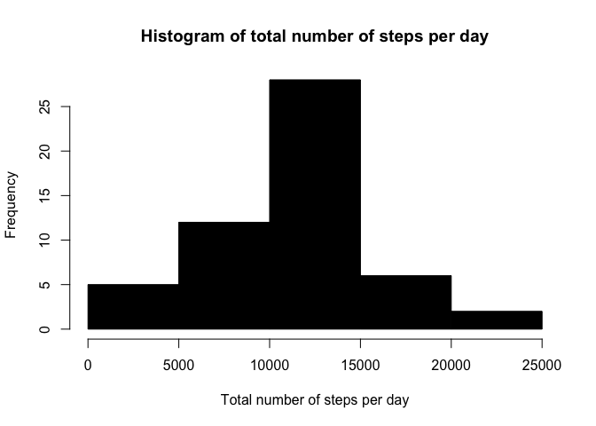
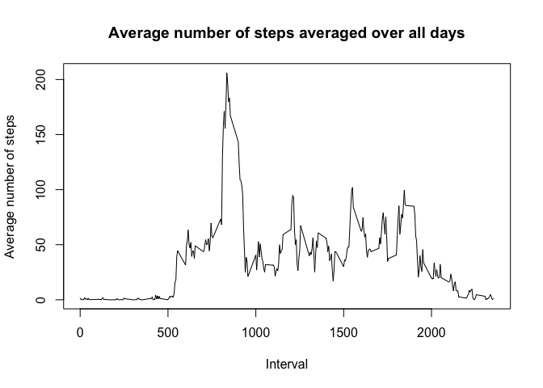
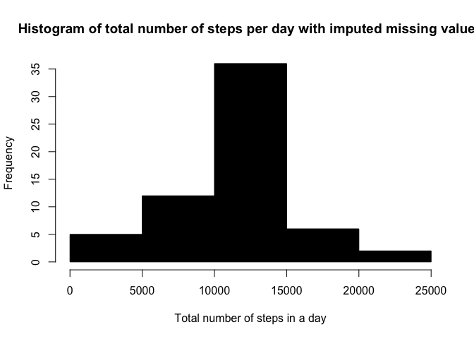
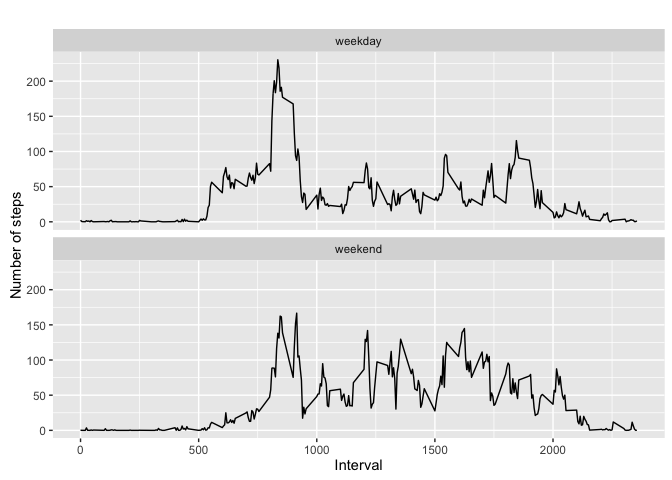

# Reproducible Research: Peer Assessment 1

```r
# load packages necessary for this project
library(knitr)
```

```
## Warning: package 'knitr' was built under R version 3.2.5
```

```r
library(dplyr)
```

```
## 
## Attaching package: 'dplyr'
```

```
## The following objects are masked from 'package:stats':
## 
##     filter, lag
```

```
## The following objects are masked from 'package:base':
## 
##     intersect, setdiff, setequal, union
```

```r
library(ggplot2)
```

```
## Warning: package 'ggplot2' was built under R version 3.2.4
```

```r
opts_chunk$set(echo = TRUE)
```

## Loading and preprocessing the data

```r
# load the activity data in data frame
data_orig <- read.csv("~/datasciencecoursera/RepData_PeerAssessment1/activity.csv")
# omit cases with missing data
data_processed <- na.omit(data_orig)
```

## What is mean total number of steps taken per day?

```r
# group data by date and sum the steps for each day
steps_per_day <- aggregate(steps ~ date, data_processed, sum)

# Histogram of the total number of steps taken each day
hist(steps_per_day$steps, col=1, main="Histogram of total number of steps per day", xlab="Total number of steps per day")
```

<!-- -->

```r
## Mean number of steps taken each day
mean(steps_per_day$steps)
```

```
## [1] 10766.19
```

```r
## Median number of steps taken each day
median(steps_per_day$steps)
```

```
## [1] 10765
```

## What is the average daily activity pattern?

```r
# group data by interval and calculate the average number of steps in an interval across all days
steps_per_interval <- aggregate(steps ~ interval, data_processed, mean)

# Time series plot of the average number of steps taken every 5-minute interval (x-axis) and the average number of steps across all days (y-axis)
plot(steps_per_interval$interval, steps_per_interval$steps, type='l', col=1, 
     main="Average number of steps averaged over all days", xlab="Interval", 
     ylab="Average number of steps")
```

<!-- -->

```r
# The 5-minute interval that, on average, contains the maximum number of steps
steps_per_interval[which.max(steps_per_interval$steps), ]
```

```
##     interval    steps
## 104      835 206.1698
```
## Imputing missing values

```r
# Number of rows with missing values in the dataset 
nrow(data_orig[!complete.cases(data_orig),])
```

```
## [1] 2304
```

```r
# Create a new dataset that is equal to the original dataset but with the missing data filled in
data <- data_orig
# replace NA's by the mean for that 5-minute interval which are kept in 'steps_per_interval'
for (i in 1:nrow(data)){
  if (is.na(data$steps[i])){
    interval <- data$interval[i]
    data$steps[i] <- steps_per_interval$steps[which(steps_per_interval$interval == interval)]
  }
}
# group steps by date and sum them to get total number of steps in a day
steps_per_day_filled <- aggregate(steps ~ date, data, sum)

# Histogram of the total number of steps taken each day after missing values are imputed
hist(steps_per_day_filled$steps, col=1, main="Histogram of total number of steps per day with imputed missing values", xlab="Total number of steps in a day")
```

<!-- -->

```r
## Mean number of steps taken each day
mean(steps_per_day_filled$steps)
```

```
## [1] 10766.19
```

```r
## Median number of steps taken each day
median(steps_per_day_filled$steps)
```

```
## [1] 10766.19
```
The mean matches with the one before imputing missing values, while median value slightly increases.

## Are there differences in activity patterns between weekdays and weekends?

```r
# Create a new factor variable in the dataset with two levels – “weekday” and “weekend” indicating whether a given date is a weekday or weekend day.

# create a temporary variable to indicate type of the day: 
day <- rep("weekday",len = nrow(data))
k <- which(weekdays(as.Date(data$date, "%Y-%m-%d")) == "Saturday" | weekdays(as.Date(data$date, "%Y-%m-%d")) == "Sunday")
day[k] <- "weekend"
# add a new column to data to indicate a weekday or weekend day
data$day <- as.factor(day)
# group steps by interval and calculate the average number of steps in an interval across all weekday days or weekend days 
steps_per_interval_week <- aggregate(steps ~ interval+day, data, mean)
# Panel plot comparing the average number of steps taken per 5-minute interval (x-axis) and the average number of steps taken, averaged across all weekday days or weekend days (y-axis). 
qplot(interval, steps, data=steps_per_interval_week, geom=c("line"), xlab="Interval", ylab="Number of steps", main="") + facet_wrap(~ day, ncol=1)
```

<!-- -->
